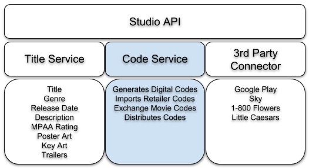
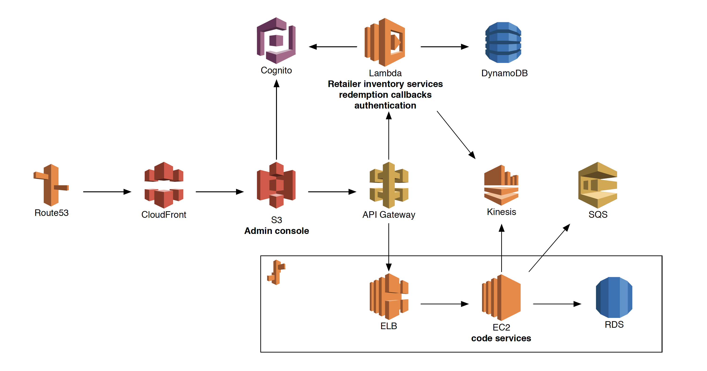
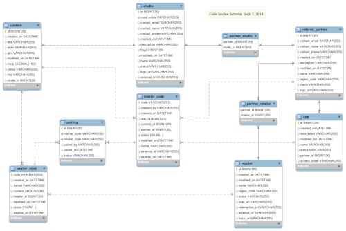

# Code Service
This service provides access to codes for digital movies.  It can both generate codes
on your behalf as well as import codes from other systems.  It is one of multiple services
that make up the Studio API.

## AWS Architecture & Setup

[Swagger Documentation](https://dev-api.universalinvents.com/0.1/)

## DB Schema
Flyway is utilized to manage the MySQL database schema changes.  Here is an EER diagram
of the latest version of the schema (click for a higher resolution image):

## License
Code Service is Open Source software released under the [Apache 2.0 license](http://www.apache.org/licenses/LICENSE-2.0.html).