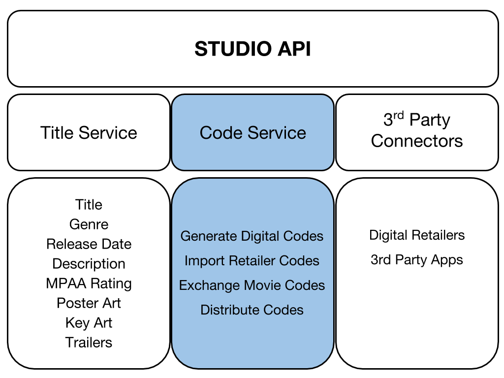

# Code Service
This service provides access to codes for digital movies.  It can both generate codes
on your behalf as well as import codes from other systems.  It is one of multiple services
that make up our Studio API.

## Code Structure
*provide overview of directory structure and technology used (i.e. Spring Boot)*

## AWS Architecture & Setup
*show architecture diagram and describe required environment variables*

[Swagger Documentation](https://api.universalinvents.com/dev/)

## DB Schema
Flyway is utilized to manage the MySQL database schema changes.  Here is an EER diagram
of the latest version of the schema (click for a higher resolution image):

